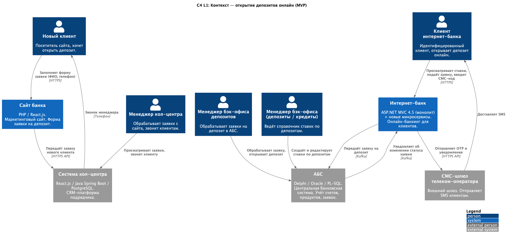
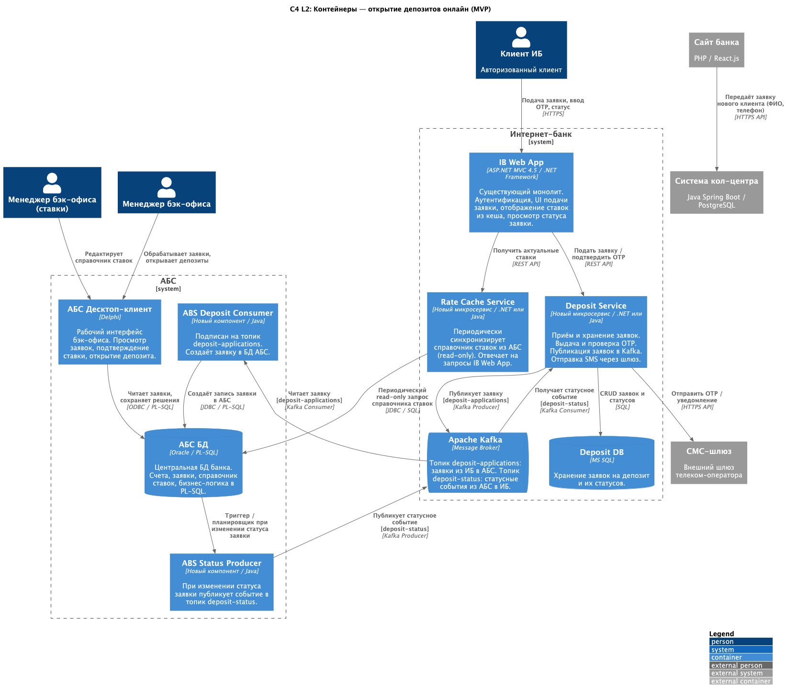

# Задание 3. Открытие депозитов онлайн

[Описание задания](./TaskDescription.md)

### **Название задачи:**
Концептуальная архитектура MVP: открытие депозитов онлайн

### **Автор:**
Sergey Podzemelnykh

### **Дата:**
2026-05-05

### **Функциональные требования**

| **№** | **Действующие лица или системы** | **Use Case** | **Описание** |
| :-: | :- | :- | :- |
| UC-1 | Новый клиент, Сайт, Система кол-центра | Подача заявки на депозит с сайта | Новый клиент вводит ФИО и номер телефона на странице депозитов. Сайт передаёт заявку в систему кол-центра. Менеджер кол-центра звонит клиенту, рассказывает об условиях. Для открытия депозита клиент посещает отделение для идентификации. |
| UC-2 | Клиент ИБ, Интернет-банк, АБС, СМС-шлюз | Подача заявки на депозит через интернет-банк | Авторизованный клиент просматривает список депозитов с актуальными и персонализированными ставками, выбирает депозит, указывает счёт и сумму. Подтверждает операцию СМС-кодом. Заявка уходит в АБС через очередь сообщений. Клиент получает СМС-уведомления о подтверждении ставки и об открытии депозита. |
| UC-3 | Менеджер бэк-офиса, АБС | Обработка заявки на депозит | Менеджер бэк-офиса видит поступившую заявку в АБС-клиенте, проверяет условия, при необходимости корректирует ставку, подтверждает и открывает депозит. |
| UC-4 | Менеджер бэк-офиса (депозиты / кредиты), АБС | Ведение справочника ставок | Уполномоченный сотрудник создаёт и редактирует ставки по депозитам в АБС. Актуальные значения подтягиваются в кеш интернет-банка при следующей синхронизации. |

### **Нефункциональные требования**

| **№** | **Требование** |
| :-: | :- |
| 1 | Доступность клиентских сервисов (сайт, интернет-банк) — не ниже 99,9%; работа 24/7 |
| 2 | Развёртывание интернет-банка в двух ЦОД с автоматическим переключением при отказе основного |
| 3 | Независимость работоспособности интернет-банка от доступности АБС (асинхронная интеграция через Kafka) |
| 4 | Горизонтальное масштабирование новых микросервисов интернет-банка; равномерное распределение нагрузки |
| 5 | Загрузка справочника ставок в ИБ — не более 200 мс; отклик UI по клиентским операциям — миллисекунды |
| 6 | Шифрование трафика между клиентом и ИБ / сайтом (TLS) |
| 7 | СМС для подтверждения и уведомлений реализуется командой банка без доработки ядра ИБ подрядчиком |
| 8 | Apache Kafka — стандарт для новых асинхронных интеграций |
| 9 | Новые сервисы вынесены из монолита ИБ (ASP.NET MVC 4.5, несовместимого с Kafka) в отдельные микросервисы |
| 10 | Кеширование справочника ставок на стороне интернет-банка |
| 11 | Новые клиенты обязаны пройти идентификацию в отделении (требование законодательства) |
| 12 | Разделение доступа: бэк-офис депозитов и бэк-офис кредитов работают с разными данными |

### **Решение**

Диаграммы (PlantUML, C4 Model):
- [c4_context.puml](./c4_context.puml) — контекстная диаграмма (C4 L1)
- [c4_containers.puml](./c4_containers.puml) — диаграмма контейнеров (C4 L2), детализированы интернет-банк и АБС

#### Логика принятых решений

**Асинхронная интеграция ИБ с АБС через Kafka**

БД АБС уже перегружена, прямые вызовы из интернет-банка создают риск деградации всей банковской системы. Для передачи заявок и статусных событий выбрана асинхронная модель: новый Deposit Service публикует заявку в топик Kafka, отдельный ABS Deposit Consumer читает её и создаёт запись в АБС. Обратная связь (изменение статуса) идёт тем же путём — из АБС в Kafka, Deposit Service подписан на статусные события. Это делает интернет-банк независимым от доступности АБС и снимает прямую нагрузку с её БД.

**Вынесение нового функционала в микросервисы за пределы монолита ИБ**

Существующий монолит (ASP.NET MVC 4.5 / .NET Framework) несовместим с Kafka и горизонтально масштабируется с трудом. Новые компоненты — Deposit Service и Rate Cache Service — реализуются как отдельные микросервисы. Монолит взаимодействует с ними через REST API, что минимизирует изменения в существующей кодовой базе. Новые сервисы деплоятся в оба ЦОД и масштабируются независимо.

**СМС-функционал силами банка**

Доработка ядра ИБ для СМС требует участия подрядчика и значительных затрат. Deposit Service самостоятельно вызывает СМС-шлюз телеком-оператора для отправки OTP-кода и статусных уведомлений. Команда банка полностью контролирует этот компонент.

**Rate Cache Service для справочника ставок**

Для обеспечения отклика в пределах 200 мс при недопустимости прямых вызовов АБС введён Rate Cache Service. Он по расписанию (read-only запрос) синхронизирует ставки из АБС и отвечает на запросы монолита ИБ. Ставки меняются редко, поэтому небольшая задержка актуализации кеша приемлема.

**Передача заявок с сайта напрямую в систему кол-центра**

Новый клиент с сайта не идентифицирован и не является клиентом банка. Его заявка (ФИО, телефон) передаётся напрямую в систему кол-центра через HTTPS API. Интернет-банк и АБС в этом потоке не задействованы. Менеджер кол-центра звонит клиенту, после чего клиент посещает отделение для идентификации.

### **Альтернативы**

**Синхронная интеграция интернет-банка с API АБС**

Самый простой вариант: при подаче заявки ИБ напрямую вызывает API АБС. Отклонён — БД АБС перегружена, поток онлайн-заявок поставит под угрозу работу всего банка. При недоступности АБС интернет-банк перестаёт принимать заявки, что нарушает требование R4 (независимость ИБ от АБС).

**Реализация нового функционала внутри монолита ИБ**

Добавление депозитного функционала в существующий монолит без выноса в микросервисы. Отклонён — монолит несовместим с Kafka, плохо масштабируется горизонтально, а изменения в ядре системы привязаны к подрядчику. Такой подход противоречит нефункциональным требованиям по масштабируемости и плану перехода на микросервисы.

**Прямая интеграция сайта с АБС для заявок новых клиентов**

Вместо передачи заявки через систему кол-центра — прямая запись в АБС. Отклонён — новые клиенты не идентифицированы, создавать для них записи в АБС до прохождения идентификации нецелесообразно и небезопасно. Кроме того, кол-центр — обязательный этап действующей операционной модели банка.

**Недостатки, ограничения, риски**

- **Eventual consistency.** Из-за асинхронной интеграции статус заявки в ИБ отстаёт от реального состояния в АБС. Клиент увидит обновление только после доставки статусного события через Kafka.
- **Сложность двухдатацентровой конфигурации.** Kafka-кластер и БД Deposit Service требуют репликации между ЦОД, что увеличивает сложность эксплуатации и первоначальной настройки.
- **Единственный брокер — точка отказа.** Отказ Kafka-кластера означает прекращение приёма заявок. Необходима кластерная конфигурация с мониторингом и алертами.
- **Кеш ставок может устареть.** При изменении ставки в АБС ИБ покажет старое значение до следующей синхронизации. Нужно согласовать приемлемый интервал обновления кеша с бизнесом.
- **Экспертиза по Kafka.** Технология новая для банка, потребуется время на обучение команды и выработку операционных практик.
- **АБС масштабируется только вертикально.** При существенном росте числа онлайн-заявок АБС может стать узким местом даже при асинхронной интеграции.
