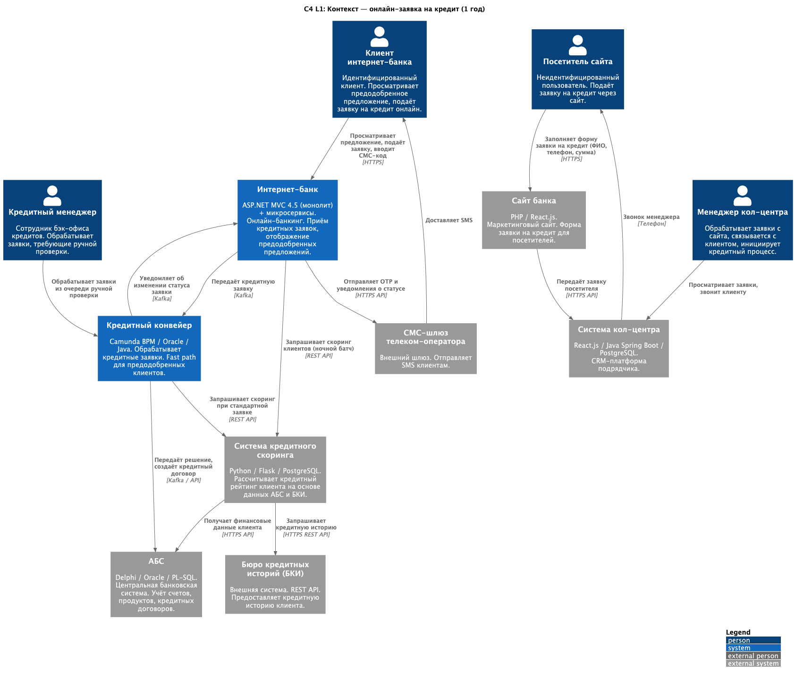
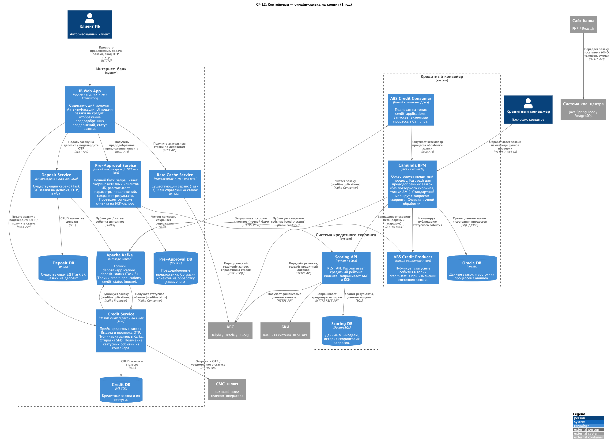

# Задание 5. Заявка на кредит онлайн

[Описание задания](./TaskDescription.md)

### **Название задачи:**
Концептуальная архитектура: онлайн-заявка на кредит (1 год)

### **Автор:**
Sergey Podzemelnykh

### **Дата:**
2026-05-05

### **Функциональные требования**

| **№** | **Действующие лица или системы** | **Use Case** | **Описание** |
| :-: | :- | :- | :- |
| UC-1 | Клиент ИБ, Интернет-банк, Pre-Approval Service | Просмотр предодобренного предложения | Авторизованный клиент заходит в ИБ и видит персонализированное предодобренное предложение по кредиту (сумма, ставка, срок). Предложение сформировано ночным батчем на основе скорингового рейтинга клиента. Если предложения нет — клиент видит стандартную форму заявки. |
| UC-2 | Клиент ИБ, Интернет-банк, Credit Service, Кредитный конвейер, СМС-шлюз | Подача заявки по предодобренному предложению | Клиент принимает предодобренное предложение, вводит недостающие данные (цель, счёт для зачисления), подтверждает заявку СМС-кодом. Credit Service публикует заявку в Kafka. Кредитный конвейер обрабатывает её по ускоренному маршруту (fast path): скоринг не запрашивается повторно, данные берутся из Pre-Approval DB. Решение принимается автоматически в течение дня. Клиент получает СМС-уведомление о решении. |
| UC-3 | Посетитель сайта, Сайт банка, Система кол-центра | Подача заявки на кредит с сайта | Неидентифицированный пользователь заполняет форму на сайте (ФИО, телефон, желаемая сумма и срок). Сайт передаёт заявку в систему кол-центра. Менеджер кол-центра связывается с клиентом, уточняет данные, при необходимости инициирует кредитный процесс через конвейер вручную. Идентификация клиента и скоринг происходят внутри кредитного конвейера стандартным путём. |
| UC-4 | Клиент ИБ, Интернет-банк, Credit Service, Кредитный конвейер, Система кредитного скоринга, БКИ | Подача стандартной заявки через ИБ | Клиент ИБ без предодобренного предложения заполняет полную форму заявки. Credit Service публикует заявку в Kafka. Кредитный конвейер запрашивает скоринг (АБС + БКИ), проводит стандартную проверку. При наличии достаточных данных решение принимается автоматически в течение дня. При необходимости — передаётся кредитному менеджеру. Клиент получает СМС-уведомление. |
| UC-5 | Pre-Approval Service, Система кредитного скоринга, АБС | Ночной батч предодобренных предложений | Ежедневно ночью Pre-Approval Service запускает пакетный процесс: выбирает активных клиентов ИБ, давших согласие на обработку данных БКИ, запрашивает скоринговые рейтинги у Системы кредитного скоринга, рассчитывает параметры предложений по внутренним правилам, сохраняет результаты в Pre-Approval DB. |
| UC-6 | Кредитный менеджер, Кредитный конвейер, АБС, СМС-шлюз | Ручная обработка заявки кредитным менеджером | Заявки, не прошедшие автоматическое одобрение (недостаточно данных, пограничный скоринг, подозрение на мошенничество), попадают в очередь ручной обработки в кредитном конвейере. Кредитный менеджер изучает данные, принимает решение. Статус заявки обновляется в АБС, клиент получает СМС. |

### **Нефункциональные требования**

| **№** | **Требование** |
| :-: | :- |
| 1 | Время автоматического принятия решения по заявке (fast path через кредитный конвейер) — не более 1 часа с момента получения заявки в Kafka. |
| 2 | Ночной батч Pre-Approval Service завершается до 06:00 по московскому времени; в рабочие часы нагрузка на Систему кредитного скоринга от батча отсутствует. |
| 3 | Запрос данных клиента в БКИ выполняется только при наличии зафиксированного согласия. Согласие хранится в Pre-Approval DB с датой и версией текста. |
| 4 | Credit DB и Pre-Approval DB изолированы от Deposit DB. Кредитные данные клиента недоступны сервисам, работающим с депозитными заявками, и наоборот. |
| 5 | Скоринговые данные, полученные при ночном батче, считаются актуальными не более 24 часов. Если предодобренное предложение старше 24 часов — конвейер запрашивает скоринг повторно перед принятием решения. |
| 6 | Все запросы в БКИ логируются (идентификатор запроса, время, идентификатор клиента, ответ). Лог хранится не менее 5 лет согласно требованиям регулятора. |
| 7 | При автоматической обработке кредитной заявки проводится AML-проверка: имя клиента сверяется с санкционными списками. Подозрительные заявки автоматически направляются на ручную проверку. |
| 8 | Credit Service не имеет прямого доступа к БД АБС. Взаимодействие с АБС — исключительно через Kafka (топики credit-applications, credit-status). |
| 9 | Доступность Credit Service и Pre-Approval Service — не ниже 99,9%; оба сервиса деплоятся в двух ЦОД и масштабируются горизонтально. |
| 10 | Время отклика Credit Service на подачу заявки — не более 3 секунд при нормальной нагрузке. |

### **Решение**

Диаграммы (PlantUML, C4 Model):
- [c4_context.puml](./c4_context.puml) — контекстная диаграмма (C4 L1)
- [c4_containers.puml](./c4_containers.puml) — диаграмма контейнеров (C4 L2), детализированы интернет-банк и кредитный конвейер

#### Логика принятых решений

**Credit Service и Pre-Approval Service как отдельные микросервисы**

Паттерн Task 3 повторяется без изменений: монолит ИБ (ASP.NET MVC 4.5) несовместим с Kafka и плохо масштабируется горизонтально. Новый функционал выносится в микросервисы за периметр монолита. Credit Service отвечает за приём заявок, OTP и Kafka-интеграцию с кредитным конвейером. Pre-Approval Service — отдельный сервис с собственной БД и ночным батчем. Разделение изолирует тяжёлый пакетный процесс от потока клиентских запросов.

**Kafka как транспорт между ИБ и кредитным конвейером**

Синхронный вызов кредитного конвейера из Credit Service создаёт жёсткую связность и нарушает требование независимости ИБ от внешних систем. Кредитный конвейер обрабатывает заявку несколько минут (скоринг, AML, правила) — держать HTTP-соединение открытым неприемлемо. Заявка публикуется в топик credit-applications, конвейер забирает её асинхронно. Статусные события возвращаются через топик credit-status. Схема идентична депозитной интеграции из Task 3.

**Fast path в кредитном конвейере для предодобренных клиентов**

Кредитный конвейер на Camunda BPM позволяет описывать альтернативные маршруты бизнес-процесса. Для заявок с флагом `pre_approved` реализуется отдельный маршрут: скоринг пропускается (данные взяты из Pre-Approval DB и переданы в событии Kafka), проводятся только AML-проверка и базовые валидации. Это позволяет принимать автоматическое решение без повторного запроса в БКИ.

**Ночной батч Pre-Approval Service**

Запрос скоринга в реальном времени при входе клиента в ИБ создаёт неприемлемую задержку и нагрузку на Систему кредитного скоринга и БКИ в пиковые утренние часы. Пакетный подход ночью решает обе проблемы: клиент видит готовое предложение мгновенно, скоринговая система нагружается в нерабочее время. Согласие клиента на БКИ-запрос хранится в Pre-Approval DB и проверяется перед каждым батчем.

**Разделение Credit DB и Pre-Approval DB**

Credit DB хранит текущие заявки и статусы; Pre-Approval DB — результаты ночного батча и согласия клиентов. Разные паттерны доступа, объёмы и требования по изоляции данных делают общую БД нецелесообразной. Каждая БД принадлежит только своему сервису.

**Сайт --> кол-центр для неидентифицированных пользователей**

Посетитель сайта не является клиентом банка. До прохождения идентификации создавать его записи в АБС или запускать кредитный процесс нельзя. Заявка передаётся в систему кол-центра, менеджер звонит клиенту и при его согласии инициирует стандартный кредитный процесс через конвейер. Паттерн повторяет депозитные заявки с сайта из Task 3.

### **Альтернативы**

**Скоринг в реальном времени при входе клиента вместо ночного батча**

При каждом входе клиента в ИБ немедленно запрашивать Систему кредитного скоринга и показывать предложение на лету. Отклонено по трём причинам. Запрос в БКИ занимает секунды — это критично для UX входа в ИБ. Массовый утренний вход клиентов создаёт пиковую нагрузку на скоринговую систему и БКИ. Кроме того, каждый вход означает запрос в БКИ, что увеличивает операционные расходы и может противоречить требованиям регулятора по частоте таких запросов.

**Синхронная интеграция с кредитным конвейером вместо Kafka**

Credit Service напрямую вызывает REST API кредитного конвейера при подаче заявки и ждёт ответа. Отклонено: обработка заявки занимает минуты (скоринг, AML, правила конвейера), клиент будет ждать открытого HTTP-соединения. При недоступности конвейера ИБ не сможет принимать заявки, что нарушает NFR9 и делает UX неприемлемым.

**Собственный скоринг внутри ИБ вместо использования Системы кредитного скоринга**

Реализовать ML-модель скоринга непосредственно внутри Pre-Approval Service, не вызывая внешнюю Систему кредитного скоринга. Отклонено: скоринговая система уже существует, поддерживается IT-отделом банка и интегрирована с АБС и БКИ. Дублирование модели увеличит операционные расходы и создаст расхождение результатов между онлайн-каналом и отделениями, что недопустимо с точки зрения кредитной политики.

**Недостатки, ограничения, риски**

- **Актуальность предодобренного предложения.** Скоринг действителен 24 часа. Если финансовое положение клиента ухудшилось после батча (новый кредит в другом банке, просрочка), конвейер не узнает об этом до повторной проверки. Для пограничных случаев нужна повторная проверка скоринга перед выдачей решения.
- **Сбой ночного батча.** Если батч не завершился до 06:00 (недоступность скоринговой системы или БКИ), клиенты не увидят предложений утром. Необходим мониторинг с алертами и механизм частичного запуска батча только для клиентов с истёкшим предложением.
- **Согласие клиента на БКИ-запрос.** Клиенты без согласия исключаются из батча и не получают предодобренных предложений. Нужен UX-сценарий для сбора согласия при входе в ИБ без давления на пользователя.
- **Нагрузка на скоринговую систему и БКИ при батче.** При десятках тысяч активных клиентов батч создаёт массовую нагрузку. Необходимы rate limiting на запросы в БКИ и согласование квот с бюро.
- **Eventual consistency по статусам.** Статус заявки в ИБ отстаёт от реального состояния в кредитном конвейере и АБС. При долгой ручной проверке ожидание может занимать несколько часов без обновления интерфейса.
- **Сложность fast path в Camunda.** Отдельный маршрут для предодобренных заявок усложняет модель бизнес-процесса в конвейере. Нужно тщательное тестирование, чтобы fast path не мог активироваться без валидного предодобренного предложения.
- **Единственный Kafka-кластер для депозитных и кредитных топиков.** Деградация Kafka блокирует приём заявок по обоим продуктам одновременно. Требуется кластерная конфигурация с мониторингом и алертами — аналогично требованиям Task 3.
